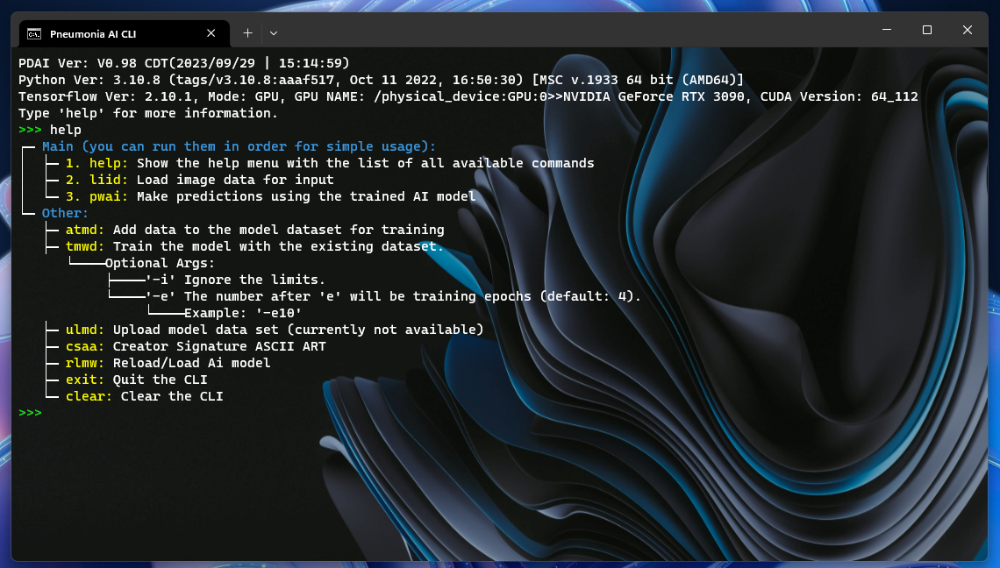

# Python CLI Template


[](https://opensource.org/licenses/MIT)

### Example usage:

  

> **Note**\
>  Please note that this image is for a project using the template.

>  **Warning**\
>  Please note that a part of this doc is generated by Ai.

This project is a template for a Python Command Line Interface (CLI) application. It includes a cmd file that checks the Python version, installs packages, and more. The Python file is a colorful CLI template that you can easily add commands to and customize. It includes some base commands as well.
The CLI also includes error handling, which can provide detailed error messages when something goes wrong.

### [Go to doc](doc.md)

## Features

- Python version check
- Package installation
- Easy command addition and customization
- Colorful CLI interface
- Base commands included
- error handling

## Getting Started

These instructions will get you a copy of the project up and running on your local machine for development and testing purposes.

### Prerequisites

- Python 3.x

### Installation

1. Clone the repo
   ```sh
   git clone https://github.com/Aydinhamedi/Python-CLI-template
   ```

## Usage

After installation, you can run the CLI application with the `CLI.cmd` and customize the CLI with `Data\CLI_main.py` file

This will start the CLI application where you can use the available commands.


## License

Distributed under the MIT License. See `LICENSE` for more information.
